## Lab01 : Creating Your First Cluster ##
### Step 1: Create a Cluster ###
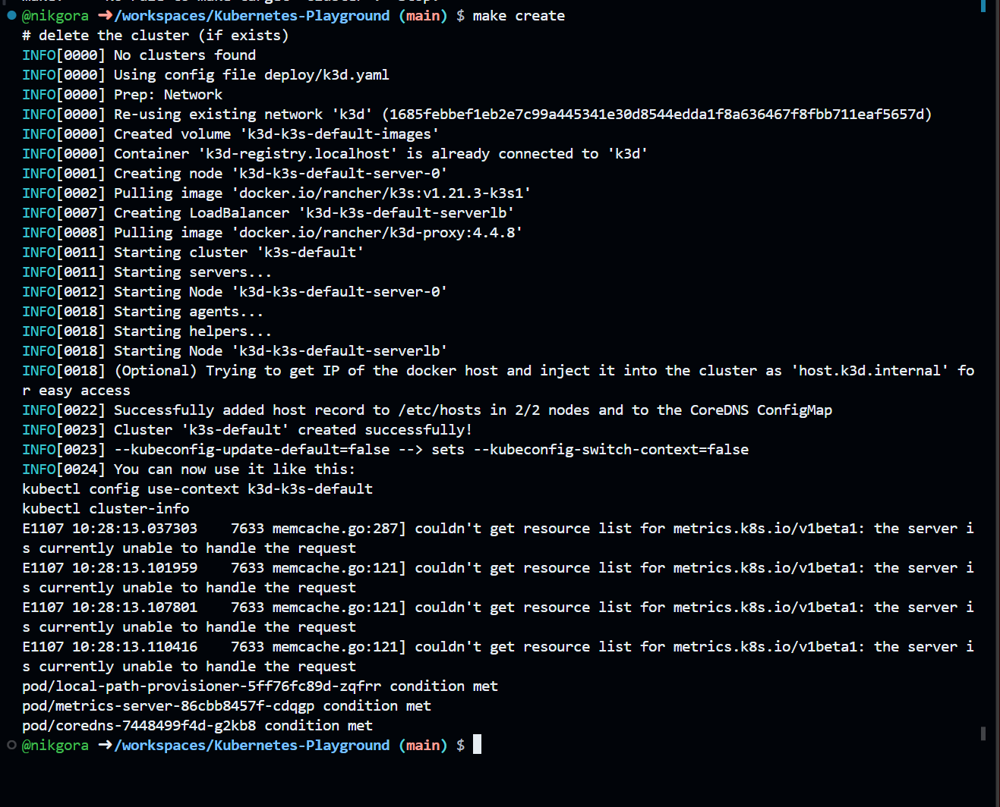
### Step 2: Checking the Node ###
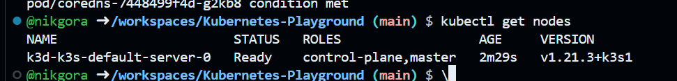
## Lab02 : Deploy An App ##
### Step 1: Download image ###
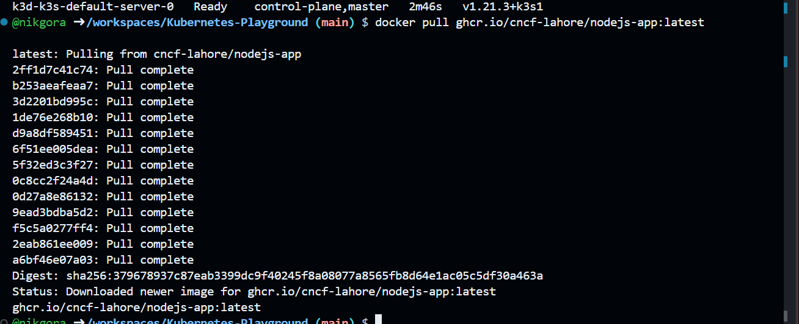
### Step 2: Deploy the app ###
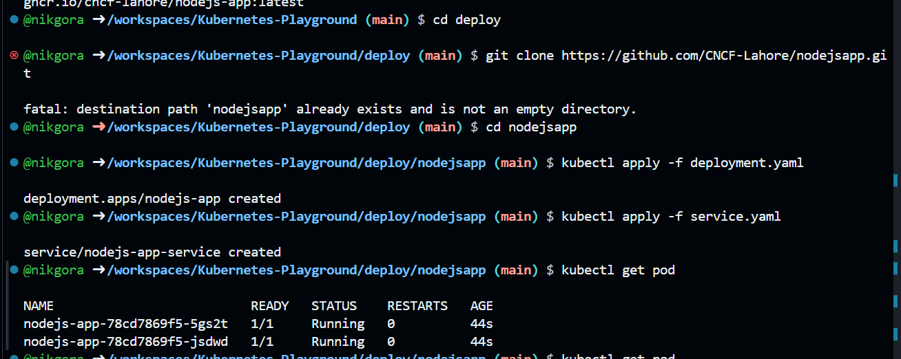
## Lab03 : Exploring Pods and Nodes ##
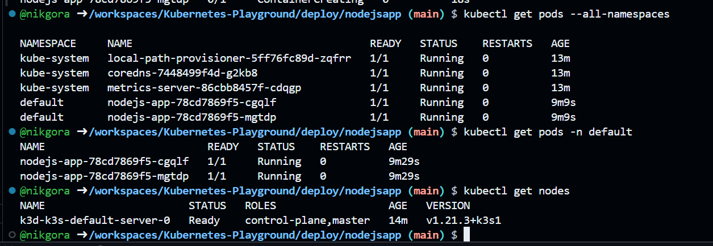
## Lab04: Exposing Your Application ##
### Step 1: Expose the app ###
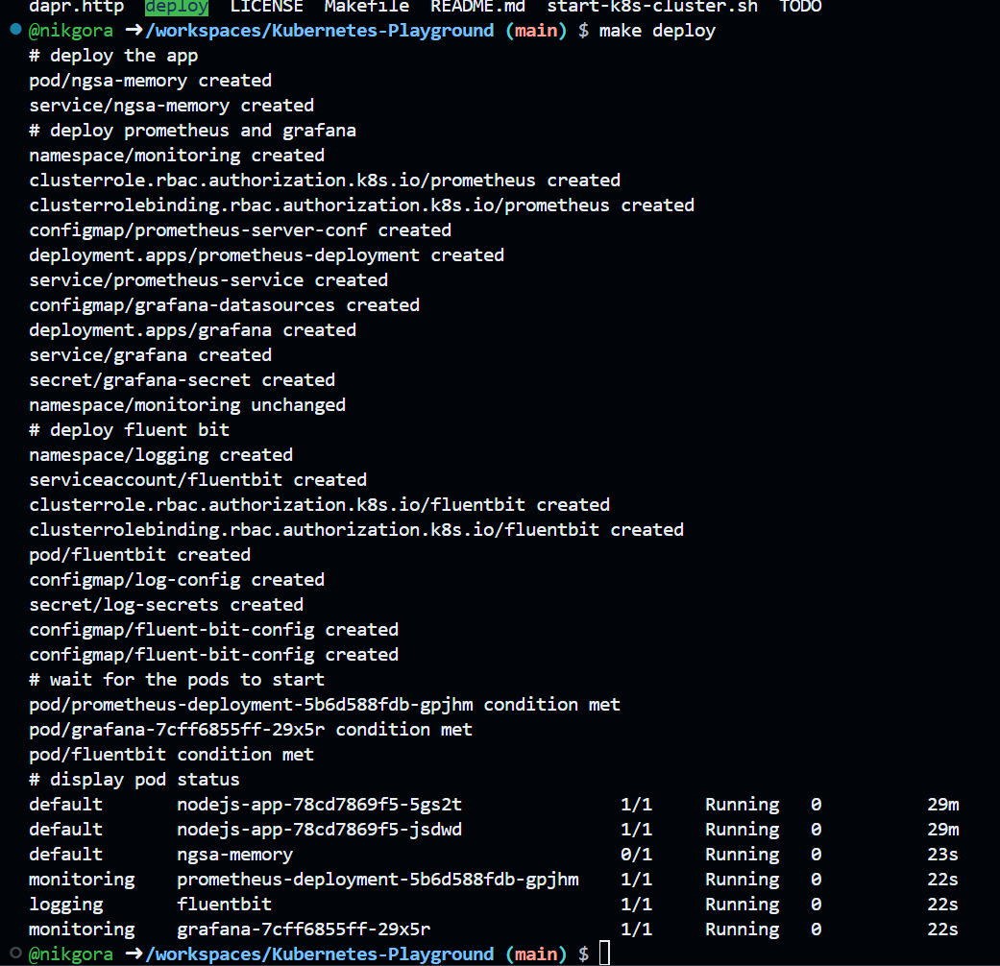
### Step 2: Check Zipkin ###
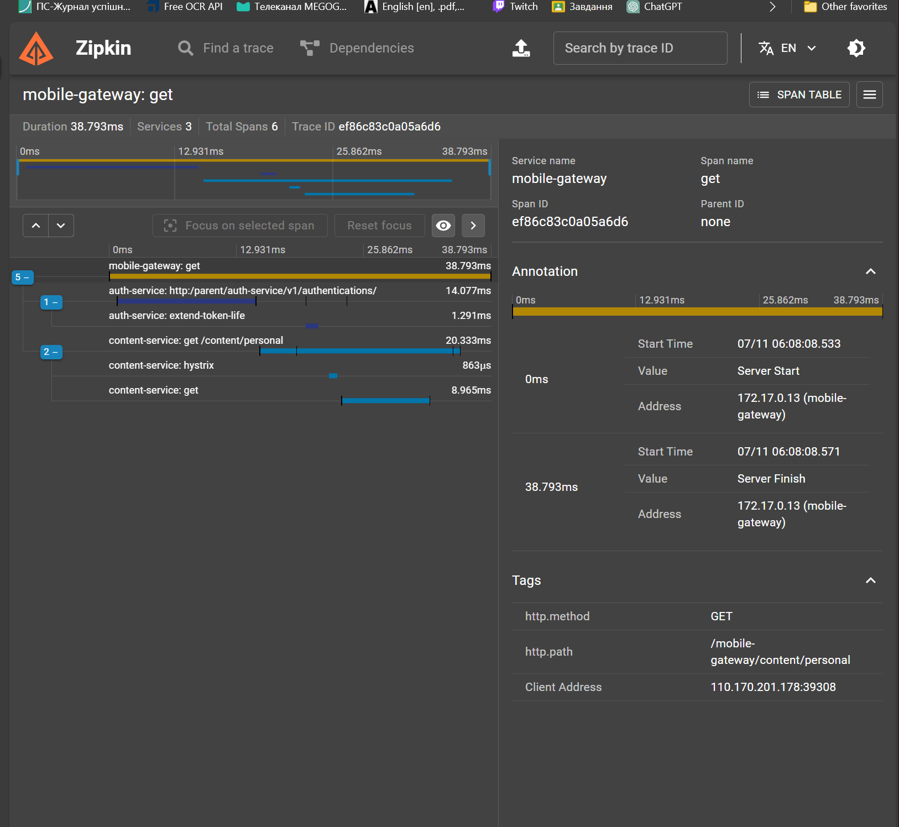
### Step 3: Check Prometheus ###
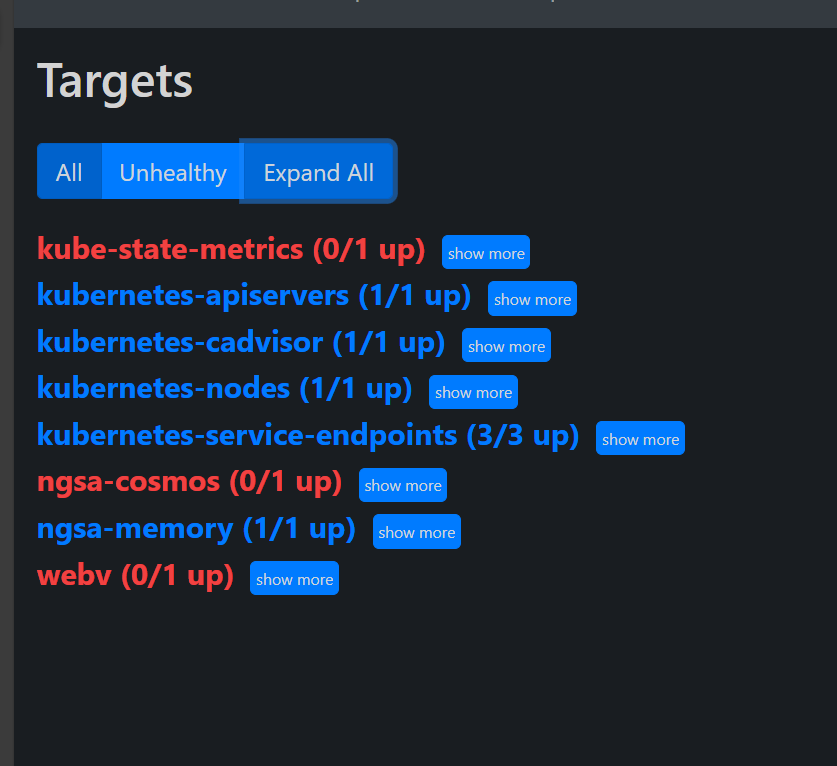
### Step 4 Change password in Grafana ###
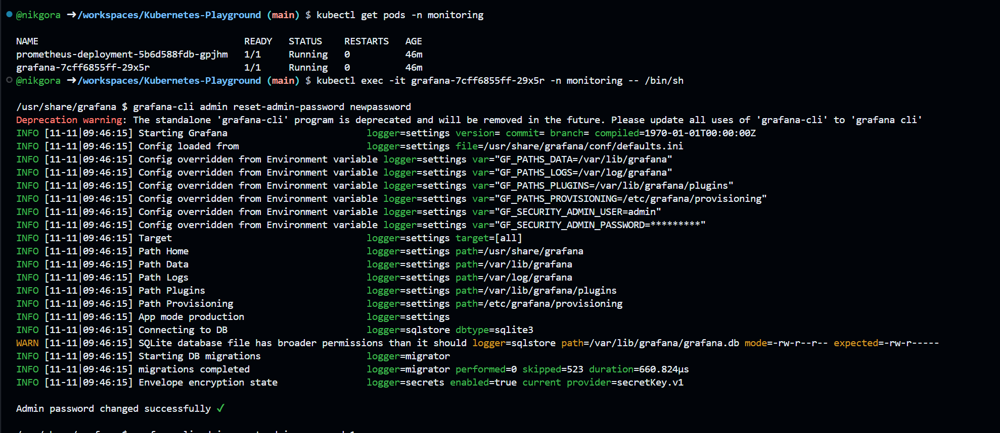
### Step 5: Import dashboard into Grafana ###
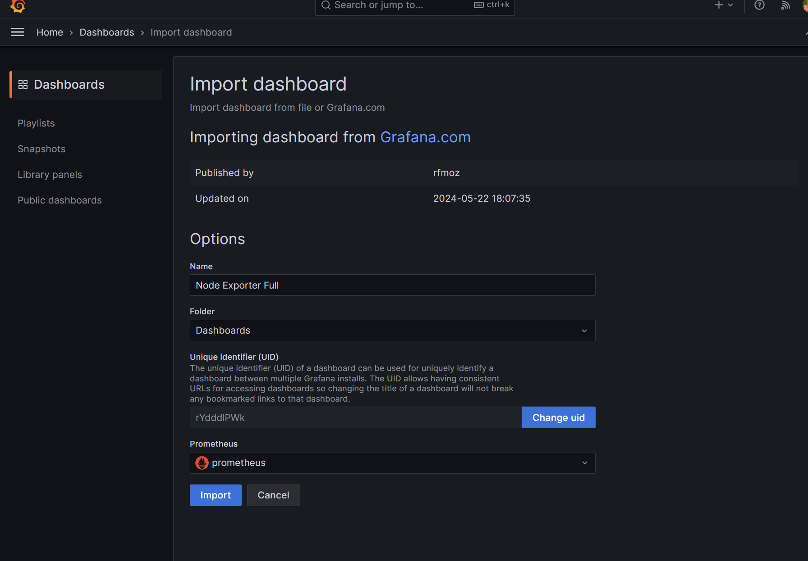
### Step 6: Check the dashboard ###
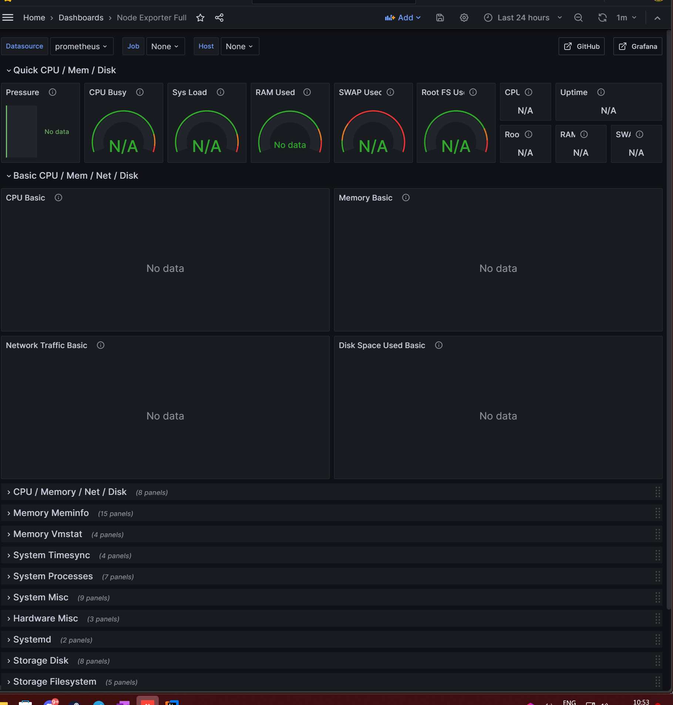
## Lab 05: Scaling Your Application ##
### Step 1: Scaling with the Declarative Approach ###
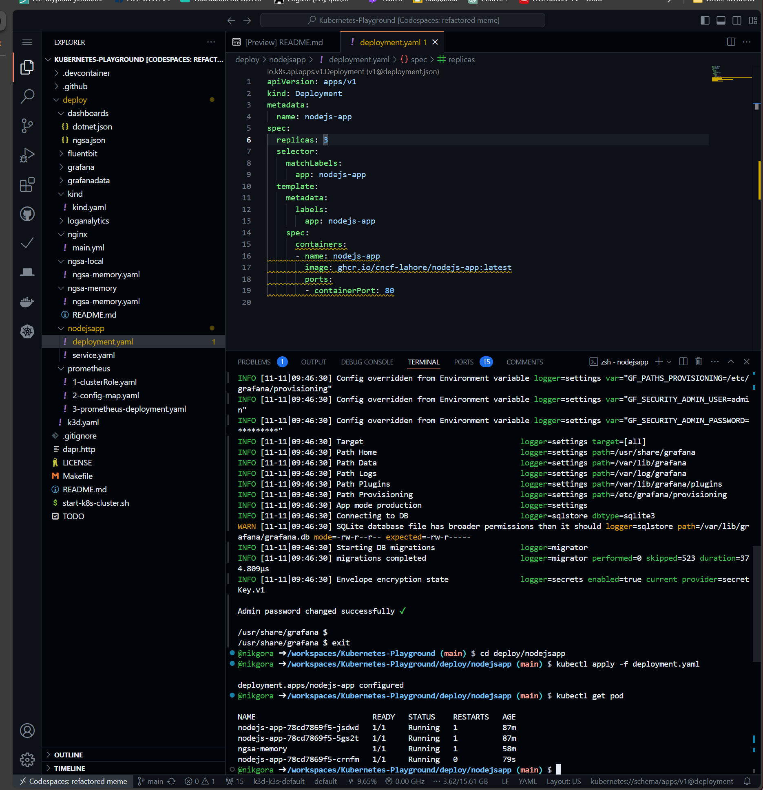
### Step 2: Scaling with the Imperative Approach ###
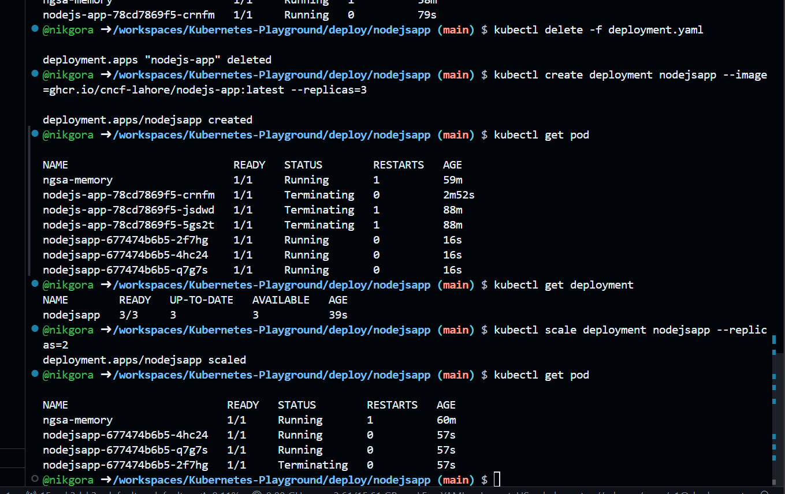
## Lab 06: Updating Your Application ##
### Step 1: Update the app ###
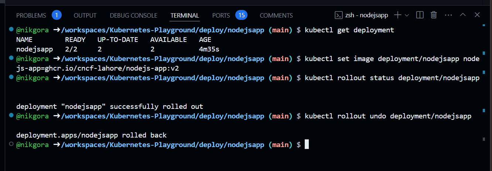
## Final quiz ##
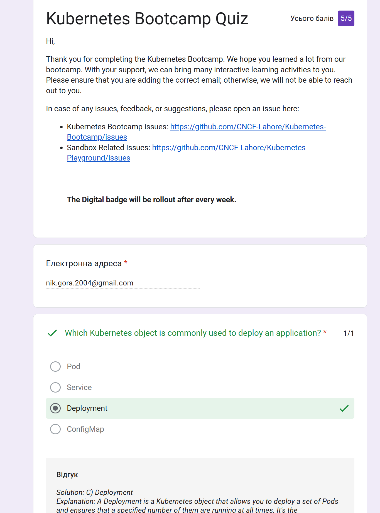